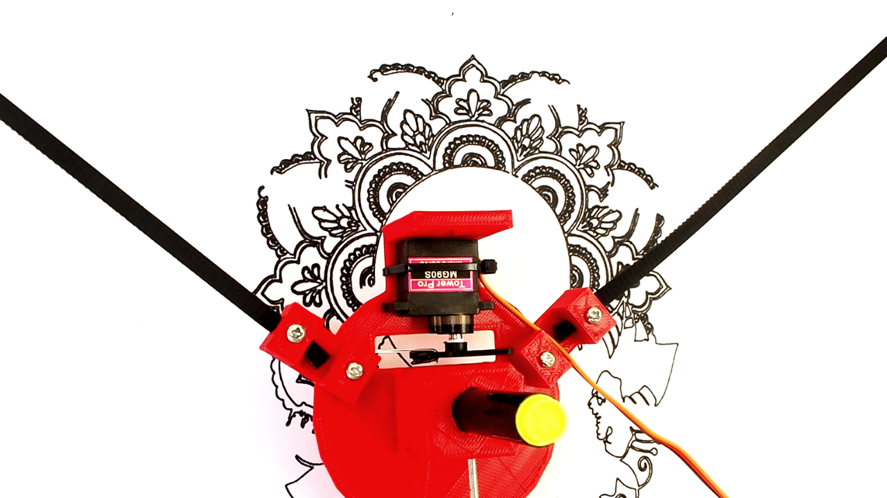
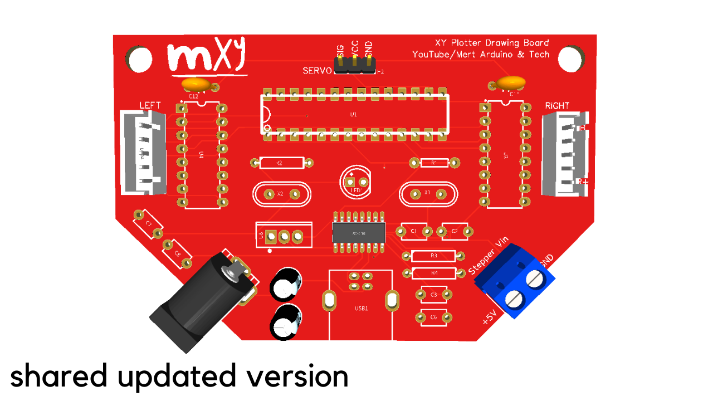
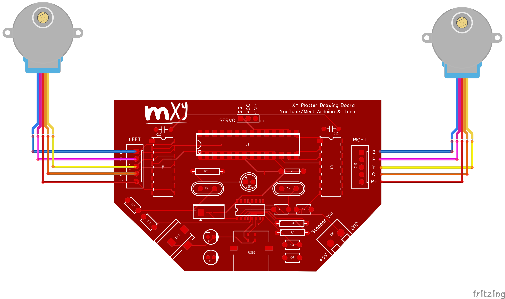
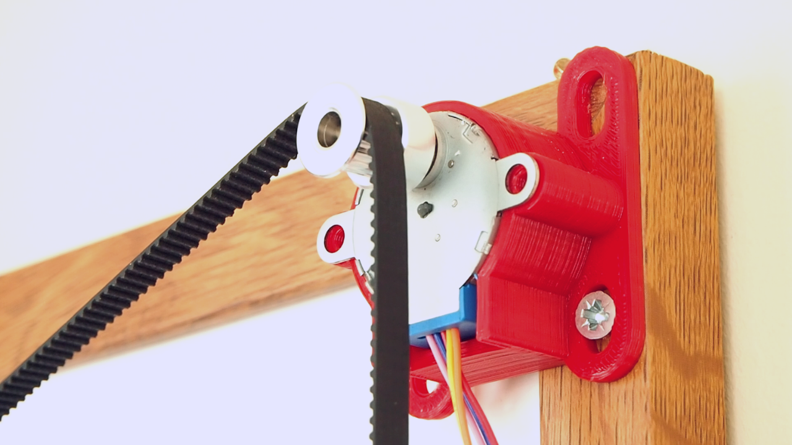

# Make XY Plotter Drawing Machine with mXY Board
In this project we gonna make XY Plotter Drawing machine with mXY Board. With Drawing Robot you can draw images on wall, panel or A4 paper. You can print pictures or print text. The machine is a simple device, that draws picture using a normal pen, some motors and some string. All required hardware for this project are listed below. We will learn how to install and use the Polargraph program for drawing control.  
  

# About mXY Board
My goal was to design the mXY board to make low budget the XY plotter drawing machine. So I designed a board that makes it easier for those who want to make this project. In the previous project, while using 2 pcs Nema17 stepper motors, this board uses 2 pcs 28YBJ-48 DC 5V 4 Phase 5 Wire Stepper Motors. Also in the previous project, Arduino Uno R3 was used as microcontroller and Adafruit Motor Shield as motor driver. This board uses Atmega328P and ULN2003 stepper driver. So you will be able to make this project with a single board. A 5V 1A adapter or powerbank is sufficient for this project to power consumption. The maximum current was observed as 0.4A when both motors were running. 

<b> Get the PCB - Schematic - Gerber files :</b> https://bit.ly/2ZWZJ7u  
<b> Get the mXY Assembled Board from PCBWayer Bazaar :</b> https://bit.ly/3dmsU89  

The board shown in the video is the test version, the updated and upgraded version of the board is at the link below. Also, for those who do not want to solder, the mXY board will be sold at PCBWay Bazaar with all components assembled. Many thanks to PCBWay for this support. 
  

# Required Components for PCB  
- **1x ATmega328P-PU with Bootloader:** https://bit.ly/2U9iwJw  
- **2x ULN2003 DIP16:** https://bit.ly/3dtexif
- **2x 28YBJ-48 5V 5 Wire Stepper Motor:** https://bit.ly/3gHHxVs
- **1x CH340G SOP16:** https://bit.ly/2TZXNaC
- **Type B USB Socket:** https://bit.ly/2WBSQqw  
- **DIP Socket 28/16 Pins:** https://bit.ly/2UahQDK  
- **12/16 MHz Crystal:** https://bit.ly/33FNTyL  
- **L7805 TO-220:** http://bit.ly/2N5WnYG  
- **10uF Capacitor:** https://bit.ly/2U98JTU  
- **22pF/0.1uF/10nF Ceramic:** https://bit.ly/2WCuQ6Y  
- **LED:** http://bit.ly/37OajhS  
- **Resistor 10K/ 1K:** https://bit.ly/2WFsNPl  
- **Power Jack Socket:** http://bit.ly/2QAzFdp  
- **2 Pin Terminal Block:** http://bit.ly/2lEgy58  
- **Male Pin Header:** https://bit.ly/3ab5h0w  
- **2x JST B5B-XH Connector:** https://bit.ly/2yXfJeI  
- **1x MG90S Servo Motor:** https://bit.ly/2XWWytT  
- **GT2 Pulley 16 Teeth Set:** https://bit.ly/36Wfayk  
- **GT2 Rubber Belt (5M):** https://bit.ly/2XTgbTT  
- **3 in 1 Jumper Wire:** http://bit.ly/2J6de9E  
- **Soldering Tools:** http://bit.ly/2PEiyVx  

# Connections  
   
An extension wire will be required for stepper motors and servos.  
- **5M Extension Wire Cable:** https://bit.ly/3gMZMJa   

# Gondola & Bracket  
   
You can find gondola and stepper motor mounting bracket 3D models in the ZIP file '**Gondola_Bracket_Models**' 
JGAURORA A5S 3D printer was used for 3D models.  
- **JGAURORA A5S 3D Printer:** https://bit.ly/2QH6GUP  

# Source Code  
- It works fine in **Arduino IDE v1.8.5** & **Processing v2.2.1**  
- Download and install the **Arduino IDE v.1.8.5** https://www.arduino.cc/en/Main/OldSoftwareReleases#previous  
- Download and install the **Processing v2.2.1** https://processing.org/download/?processing  
- Download **mXY-Plotter-Drawing-Machine** https://github.com/MertArduino/mXY-board-xy-plotter-drawing-machine/archive/master.zip  

# Arduino Source Code  
- Go to the **mXY-Plotter-Drawing-Machine\arduino-source-code-libraries\libraries** folder.  
- Copy the contents of **arduino-source-code-libraries\libraries** into your **C:\Users\YourPCname\Documents\Arduino\libraries** folder.  
- Go to the **mXY-Plotter-Drawing-Machine\arduino-source-code-libraries** folder.  
- Copy the **polargraph_server_a1** folder and paste it your **C:\Users\YourPCname\Documents\Arduino** folder. 
The "polargraph_server_a1.ino" file is the edited copy for the ULN2003 driver and 28YBJ-48 stepper motor. You can get the original version here https://github.com/euphy/polargraphcontroller/releases/tag/2017-11-01-20-30  
- Open Arduino IDE  
- Go to File -> Sketchbook -> polargraph_server_a1 | Open the **polargraph_server_a1** source code.  
- Go to Tools -> Board -> Arduino/Genuino Uno | Select the Board
- Go to Tools -> Port -> COMx | Select the Port
- Press the "verify" button in the toolbar to try and compile it.
- If it compiles, press the "upload" button in the toolbar to upload it.
- Once you do that, you should confirm that it is working properly - use the serial monitor on the board, set to **57600 baud** to make sure that it is issuing "**READY**" every couple of seconds.

# Processing Source Code  
- Go to the **mXY-Plotter-Drawing-Machine\processing-source\Processing libraries** folder.  
- Copy the contents of **processing-source\Processing libraries** into your **C:\Users\YourPCname\Documents\Processing\libraries** folder.  
- Copy the **polargraphcontroller** folder and paste it your **C:\Users\YourPCname\Documents\Processing** folder. 
- Open Processing  
- Go to File -> Sketchbook -> polargraphcontroller | Open the **polargraphcontroller** app source code.  
- Press the **Run** button in the toolbar to run the sketch.  

# polargraphcontroller  
**Stepper Motor Specifications:** 
- Press the **SETUP** button in the toolbar.  
- Define the value for **MM PER REV** as **64**  
- Define the value for **STEPS PER REV** as **4076**  
- Define the value for **MOTOR MAX SPEED** as **1000**  
- Define the value for **MOTOR ACCELERATION** as **200**  
- For more information about 28BYJ-48 Stepper Motor https://lastminuteengineers.com/28byj48-stepper-motor-arduino-tutorial/   
**Machine Dimensions:**
- 

